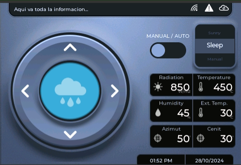
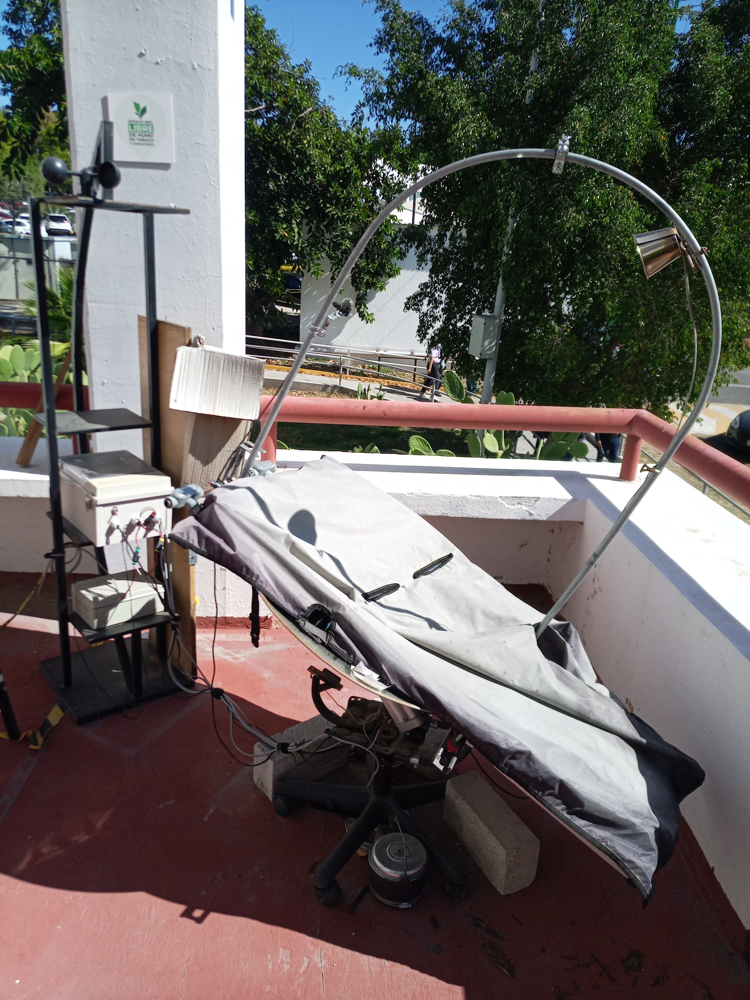

# Solar Tracker Controller with TFT HMI and ESP32

## Author

- **Diego Arana** ([GitHub Profile](https://github.com/DiegoA2487))
  - **Contributors**:
    - Guillermo Muñoz
    - Rodrigo Lopez

---

## Description

This project implements a solar oven and tracker controller based on ESP32 with an interactive HMI interface on a TFT screen. It uses WebSockets for real-time communication between the client (see branch -slave) and the master (see branch -master), enabling critical data visualization and motor movement control on two axes.

The application is designed for solar tracking systems, integrating functionalities such as:

- Control and visualization of solar radiation, ambient and focus temperatures, and humidity.
- Management of N-S and E-O motors via H-bridges, activated based on the interface button states.
- Optimized communication using WebSockets to avoid constant polling requests.

---
## Preview



_The image above shows a basic design of the HMI interface (Designed in SquireLine Studio)_



_The image above shows the prototype used for the develop of this project (Designed in Universidad Autónoma de Querétaro)_

## Features

- **Platform**: Based on ESP32 with Wi-Fi connectivity.
- **Graphical Interface**: LVGL for designing and managing the TFT display.
- **Real-Time Communication**: WebSockets for data updates and control.
- **Critical Data Visualization**: Solar radiation, temperatures, and humidity.
- **Manual Control**: Buttons to activate motors in real-time for the desired direction.
- **Energy Efficiency**: Optimized algorithms to minimize power consumption.

---

## Requirements

### Hardware

- ESP32 (e.g. WROOM)
- TFT display compatible with LVGL (e.g., CrowPanel 3.5'').
- H-Bridge for motor control.
- DC motors for movement along the axes.
- LDR array as solar sensor.
- Piranometer. 

### Software

- Arduino IDE or PlatformIO.
- Required libraries:
  - [LVGL] version 8.3.11
  - [WebSockets] v 2.6.1 by Markus Sattler
  - [ArduinoJson] v. 7.2.0 by Benoit Blanchon

---

## Installation

1. Clone the repository:
   ```bash
   git clone https://github.com/DiegoA2487/SolarOven-Tracker.git
   ```
2. Open the main file in Arduino IDE or PlatformIO.
3. Install the required libraries using the library manager.
4. Configure the ESP32 as an Access Point in the code.
5. Upload the code to the ESP32.

---

## Usage

1. Power on the system and connect the client (TFT) to the Access Point created by the master.
2. Interact with the interface buttons to control the motors.
3. Visualize critical data in real-time on the graphical interface.

---

## Contributions

Contributions are welcome. Please follow these steps:

1. Fork the project.
2. Create a branch for your contribution (`git checkout -b feature-new-functionality`).
3. Commit your changes (`git commit -m 'Add new functionality'`).
4. Push to your branch (`git push origin feature-new-functionality`).
5. Create a Pull Request in this repository.

---
